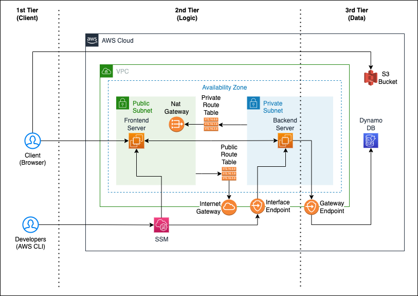
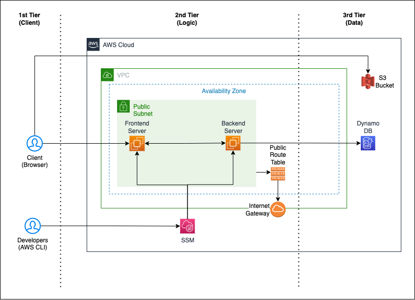

# three-tier-arch-traditional

## Introduction 
- This repo contain basic example of **Three Tier Architecture**. 
- This architecture can be deploy using **SAM**.
- Feel free to explore the code at your own risk. :stuck_out_tongue_winking_eye:

## Architecture
- Basic Complete Architecture.
- 

- We will be using this architecture for lab tutorial.
- 

## Installation
- Requires [NPM][node.js] to install yarn.
- Requires [YARN][Yarn] to run deployment script.
- Requires [AWS CLI][AWS CLI] to configure profile.
- Requires [SAM CLI][SAM CLI] to deploy stacks into AWS Cloud.

## Deploy Architecture
1. Make sure that you already setup aws profile in your local and execute below command to run script that execute sam cli for architecure deployment. Use `--guided` for first time deployment only.

```sh
yarn deploy --guided
```

## Setup Server
1. Please follow instruction in `server-setup` folder to setup api server and web server.

## License

MIT